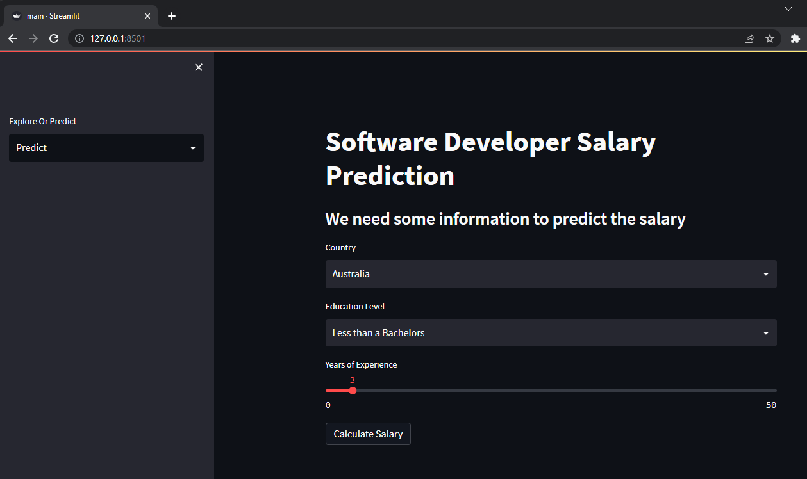

# Simple ML SalaryPrediction on Docker
The purpose of the project is to learn how to use real world data to build Machine Learning web application.

## What are we going to do
We're going to create an ML web application that can predict the Software Developer's Salary using the dataset year 2022 from stackoverflow.

## Link dataset
https://insights.stackoverflow.com/survey

## Application Dependencies
- streamlit
- scikit-learn
- pandas
- numpy
- matplotlib

## How to do this
Note: To do this you need to have docker on your machine.
<br>

**Step 1:** Simply clone this repository
```
git clone https://github.com/jakgritde/simple-ML-app-SalaryPrediction-running-on-Docker.git
```
**Step 2:** Get inside the project
```
cd simple-ML-app-SalaryPrediction-running-on-Docker
```
**Step 3:** Create docker image
```
docker build -t myapp:1.0 .
```
**Step 4:** Run app
```
docker run -d -p 8501:8501 myapp:1.0
```
**Step 6:** Point your browser to http://127.0.0.1:8501/  

## The result should look like this


**Step 7:** HAVE FUN!